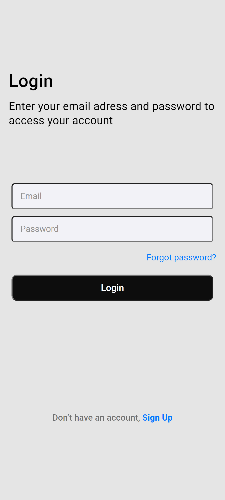

# Projeto Login

    

 

> Esta interface de Login poderá ser usada em quqlquer projeto onde seja necessário restringir o acesso 
> de usuários

## 🛠️ Ajustes e melhorias

O projeto ainda está em desenvolvimento e as próximas atualizações serão voltadas nas seguintes tarefas:

- [x] Criação do HTML 
- [x] Criação do CSS
- [ ] Atualização do Layout
- [ ] Comunicação com Banco de Dados

## 💻 Tecnologias usadas

## 🤝 Colaboradores

Agradecemos às seguintes pessoas que contribuíram para este projeto:

<table>
  <tr>
    <td align="center">
      <a href="#">
         
        
          <b>Leonardo Russo</b>
        
      </a>
    </td>
  </tr>
</table>
